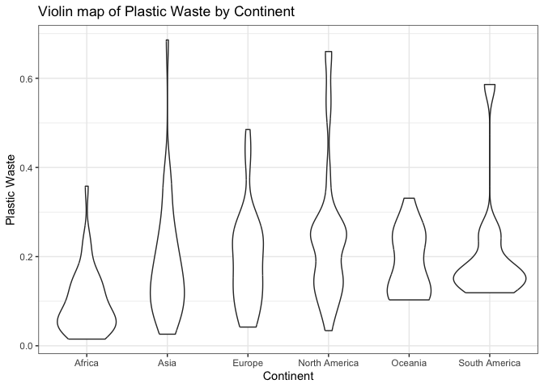
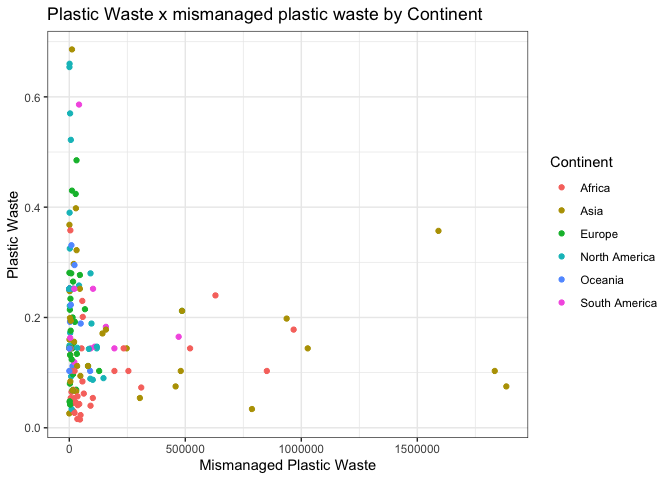
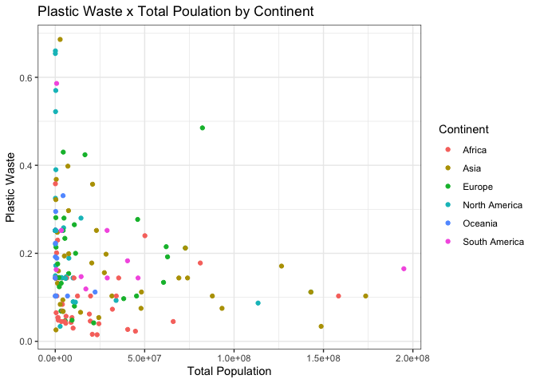

Lab 02 - Plastic waste
================
Benjamin
1/22/25

## Load packages and data

``` r
library(tidyverse) 
```

``` r
plastic_waste <- read.csv("data/plastic-waste.csv")
```

## Exercises

### Exercise 1

First plots are histograms of the distribution of plastic waste per
capita faceted by continent.

Second plot is the same data as a density plot.

``` r
#code to handle outliers
true_plastic <- plastic_waste %>%
  filter(plastic_waste_per_cap < 3, mismanaged_plastic_waste < 3000000, total_pop < 250000000, coastal_pop < 150000000)

ggplot(data = true_plastic, aes(x = plastic_waste_per_cap)) +
  #To make them one graph by color, add in fill = continent after plastice_waste_per_cap
  geom_histogram(binwidth = 0.2) + facet_wrap(~continent) +
  theme_bw()+
  labs(
      x = "Plastic waste per captia by country",
      y = "Amount",
      title = "Plastic Waste"
  )
```

<!-- -->

``` r
ggplot(
  data = true_plastic,
  mapping = aes(
    x = plastic_waste_per_cap,
    color = continent,
    fill = continent
  )
) +
  geom_density(alpha = 0.7) +
  theme_bw()+
  labs(
      x = "Plastic waste per captia",
      y = "amount",
      title = "Density map of Plastic Waste by country"
  )
```

<!-- --> What
I can tell is that they all look pretty similar in terms of plastic
waste per capita. North America has a singular outlier which makes the
graph all look the same. Took out North America outlier, all still
follow similar trend. Africa has higher plastic waste.

### Exercise 2

``` r
ggplot(
  data = true_plastic,
  mapping = aes(
    x = plastic_waste_per_cap,
    color = continent,
    fill = continent
  )
) +
  geom_density(alpha = 0.1)+
theme_bw()
```

<!-- -->

``` r
#plot side by side
ggplot(
  data = true_plastic,
  mapping = aes(
    x = continent,
    y = plastic_waste_per_cap
  )
) +
  geom_boxplot() +
  theme_bw()+
labs(
      x = "Plastic waste per captia",
      y = "amount",
      title = "Side by side of Plastic Waste by Continent"
  )
```

<!-- -->

We use color and fill for aesthetics because they are tied to a variable
(continent). This allows for the color to change with each variable and
show multiple colors. Density is universal and not tied to a variable.

### Exercise 3

They all look like vases. Asia has a really skinny neck.

``` r
ggplot(
  data = true_plastic,
  mapping = aes(
    x = continent,
    y = plastic_waste_per_cap
  )
) +
 geom_violin() +
  theme_bw()+
  labs(
      x = "Continent",
      y = "Plastic Waste",
      title = "Violin map of Plastic Waste by Continent"
  )
```

<!-- -->

### Exercise 4

Asia has more mismanaged plastic waste, yet it’s low on the amount of
plastic waste per captia.

``` r
ggplot(
  data = true_plastic,
  mapping = aes(
    x = mismanaged_plastic_waste,
    y = plastic_waste_per_cap,
    color = continent
  )
) +
  geom_point() +
  theme_bw()+
labs(
      x = "Mismanaged Plastic Waste",
      y = "Plastic Waste",
      title = "Plastic Waste x mismanaged plastic waste by Continent",
      color = "Continent"
  )
```

<!-- --> High
population in Asia yet lower on plastic waste per capita.

``` r
ggplot(
  data = true_plastic,
  mapping = aes(
    x = total_pop,
    y = plastic_waste_per_cap,
    color = continent
  )
) +
  geom_point() +
  theme_bw()+
labs(
      x = "Total Population",
      y = "Plastic Waste",
      title = "Plastic Waste x Total Poulation by Continent",
      color = "Continent"
  )
```

<!-- -->

Similar to the two plots above

``` r
ggplot(
  data = true_plastic,
  mapping = aes(
    x = coastal_pop,
    y = plastic_waste_per_cap,
    color = continent
  )
) +
  geom_point() +
  theme_bw()+
labs(
      x = "Costal Population",
      y = "Plastic Waste",
      title = "Plastic Waste x Costal Poulation by Continent",
      color = "Continent"
  )
```

<!-- -->

In total, it looks like North America has the higher plastic waste per
captia (kg/day), yet they have lower populations. So it’s not due to
people, more due to location.

### Exercise 5

Remove this text, and add your answer for Exercise 5 here.

``` r
ggplot(
  data = true_plastic,
  mapping = aes(
    x = coastal_pop / total_pop,
    y = plastic_waste_per_cap,
    color = continent
  )
) +
  theme_bw()+
  scale_color_viridis_d()+
  geom_point() +
  geom_smooth(color='black') +
labs(
      x = "Costal Population Proportion (Costal / total population)",
      y = "Plastic Waste per Capita",
      title = "Plastic Waste vs Costal Poulation Proportion",
      subtitle = "by continent",
      color = "Continent"
  ) 
```

    ## `geom_smooth()` using method = 'loess' and formula = 'y ~ x'

<!-- -->
