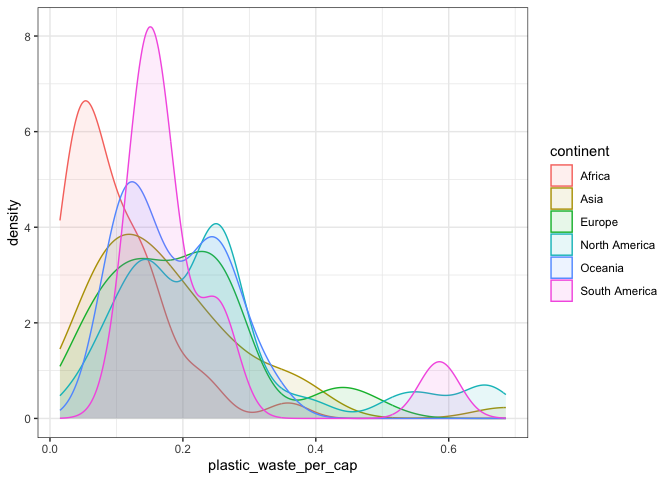
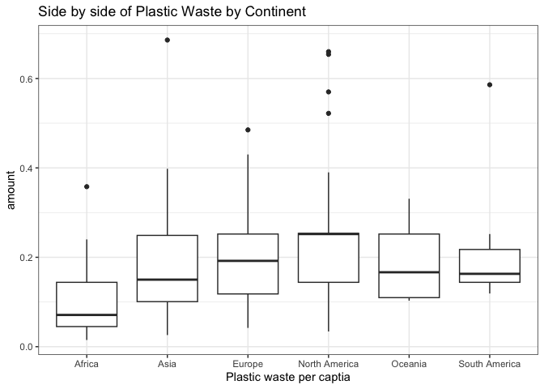

Lab 02 - Plastic waste
================
Insert your name here
Insert date here

## Load packages and data

``` r
library(tidyverse) 
```

``` r
plastic_waste <- read.csv("data/plastic-waste.csv")
```

## Exercises

### Exercise 1

First plots are histograms of the distribution of plastic waste per
capita faceted by continent.

Second plot is the same data as a density plot.

``` r
true_plastic <- plastic_waste %>%
  filter(plastic_waste_per_cap < 3)

ggplot(data = true_plastic, aes(x = plastic_waste_per_cap)) +
  #To make them one graph by color, add in fill = continent after plastice_waste_per_cap
  geom_histogram(binwidth = 0.2) + facet_wrap(~continent)
```

<!-- -->

``` r
ggplot(
  data = true_plastic,
  mapping = aes(
    x = plastic_waste_per_cap,
    color = continent,
    fill = continent
  )
) +
  geom_density(alpha = 0.7)
```

<!-- --> What
I can tell is that they all look pretty similar in terms of plastic
waste per capita. North America has a singular outlier which makes the
graph all look the same.

### Exercise 2

``` r
ggplot(
  data = true_plastic,
  mapping = aes(
    x = plastic_waste_per_cap,
    color = continent,
    fill = continent
  )
) +
  geom_density(alpha = 0.1)
```

<!-- -->

``` r
#plot side by side
ggplot(
  data = true_plastic,
  mapping = aes(
    x = continent,
    y = plastic_waste_per_cap
  )
) +
  geom_boxplot()
```

<!-- -->

We use color and fill for aesthetics because they are tied to a variable
(continent). This allows for the color to change with each variable and
show multiple colors. Density is universal and not tied to a variable.

### Exercise 3

Remove this text, and add your answer for Exercise 3 here.

``` r
# insert code here
```

### Exercise 4

Remove this text, and add your answer for Exercise 4 here.

``` r
# insert code here
```

``` r
# insert code here
```

``` r
# insert code here
```

``` r
# insert code here
```

### Exercise 5

Remove this text, and add your answer for Exercise 5 here.

``` r
# insert code here
```
